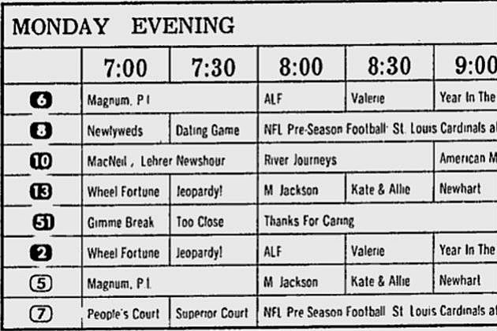

# Personal TV Guide


## About
Scrape your watchlist data from JustWatch and turn it into HTML to serve as your own TV Guide!


- [About](#about)
- [Background](#background)
- [The code](#the-code)
  - [Install the required Python modules](#install-the-required-python-modules)
  - [Credentials](#credentials)
  - [How to run it](#how-to-run-it)
    - [Make .env file](#make-env-file)
    - [Scrape the data](#scrape-the-data)
    - [List the genres](#list-the-genres)
    - [Build the HTML output](#build-the-html-output)
- [Acknowledgements](#acknowledgements)
  - [Icon](#icon)
  - [Theme](#theme)
  - [Badges](#badges)
  - [gitmoji](#gitmoji)


## Background
Remember the weekly TV guide that came with the newspaper? It was the only useful thing in there - aside from the comic section.

(I really need to figure out where to watch some *Kate & Allie* - great show!)




## The code


### Credentials
The first time you run it, you will be prompted to enter your JustWatch credentials. These get stored in a local file that will be ignored in any new commits you might make to the repository.

### How to run it

### Install the required Python modules
```
pip install -r requirements.txt
```

#### Make .env file

To get started, make a copy of */sample_files/.env-sample* and name it */.env*. This is where to set up your variables before continuing with the other steps.

| Variable | Required? | Description |
| --- | :---: | --- |
| WHEN_TO_START | y | The first hour in your guide's timeline |
| HOURS_TO_PRINT | y | How many hours worth of data to include in timeline |
| OUTFILE | y | The name of the HTML file you want to generate |
| DEV_MODE | n | Set to False for normal use. When developing and testing, set to True to limit the number of titles read from the source. |
| USE_KEYWORD_LIST | n | set to True to enable keyword lists. |
| *genre*_KEYWORDS | n | If creating custom rows in the table, enter a comma-separated list of strings to match. This is currently case-sensitive. |


#### Scrape the data
Each of these will pause and wait for you to sign in, as mentioned above. Once they finish, they will write the data to .bin files. These will be used in the next step.

```
>>> python scrape_tv.py
>>> python scrape_movies.py
```

#### List the genres
```
>>> python create_genre_list.py
```

#### Build the HTML output
With the data scraped, we can generate an HTML file.

```
>>> python build_html.py
```


## Acknowledgements

### Icon
The *Tv Guide* icon was created by  [Khalil Habib](https://github.com/Khaleelhabeeb/).

### Theme
The stylesheet is using the [Nord theme](https://www.nordtheme.com/).

### Badges
All badges are from [Shields.io](https://shields.io/), which I probably saw originally on [awesome-badges](https://github.com/badges/awesome-badges).

### gitmoji
💡 We try to use gitmoji to enhance our commit statements.

[](https://gitmoji.dev/)