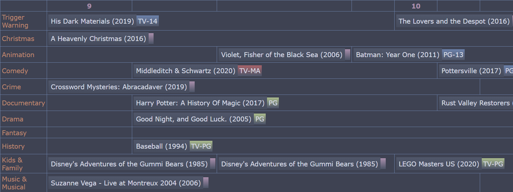

# Personal TV Guide


## About
Scrape your watchlist data from JustWatch and turn it into HTML to serve as your own Personal TV Guide!




- [About](#about)
- [Background](#background)
- [How to get it working](#how-to-get-it-working)
  - [Install the required Python modules](#install-the-required-python-modules)
  - [Make *my\_data* folder](#make-my_data-folder)
  - [Make *.env* file](#make-env-file)
  - [Run it](#run-it)
    - [A note on credentials](#a-note-on-credentials)
- [Acknowledgements](#acknowledgements)
  - [Theme](#theme)
  - [Badges](#badges)
  - [gitmoji](#gitmoji)


## Background
Remember the weekly TV guide that came with the newspaper? It was the only useful thing in there - aside from the comic section.


## How to get it working

### Install the required Python modules
```
pip install -r requirements.txt
```

### Make *my_data* folder
Create this folder. This is where your private info goes

### Make *.env* file

To get started, make a copy of */sample_files/.env-sample* and name it */.env*. This is where to set up your variables before continuing with the other steps.

| Variable | Required? | Description |
| --- | :---: | --- |
| WHEN_TO_START | y | The first hour in your guide's timeline |
| HOURS_TO_PRINT | y | How many hours worth of data to include in timeline |
| STYLESHEET_PATH | y | Where to find the CSS stylesheet |
| OUTFILE | y | The name of the HTML file you want to generate |
| USE_KEYWORD_LIST | n | set to True to enable keyword lists. |
| *genre*_KEYWORDS | n | If creating custom rows in the table, enter a comma-separated list of strings to match. This is currently case-sensitive. |
| DEV_MODE | n | Set to False for normal use. When developing and testing, set to True to limit the number of titles read from the source. |


### Run it
Each of these will pause and wait for you to sign in, as mentioned above. Once they finish, they will write the data to .bin files. These will be used in the next step.

#### A note on credentials
The first time you run the program, you will be prompted to enter your JustWatch credentials. These get stored in a local file in your *my_data* folder that will be ignored in any new commits you might make to the repository.

```
python run.py
```

If all goes well, you'll have an output file (probably in *my_data*) that will show your Personal TV Guide!


## Acknowledgements

### Theme
The default stylesheet is using the [Nord theme](https://www.nordtheme.com/).

### Badges
Custom activity badges are inspired by [Shields.io](https://shields.io/), which I probably saw originally on [awesome-badges](https://github.com/badges/awesome-badges).

### gitmoji
🎨 We use [gitmoji](https://gitmoji.dev/) to enhance our commit statements. 🚀

[](https://gitmoji.dev/)